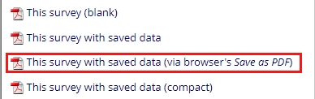

## @COLUMNS Action Tag

### Overview:

The @COLUMNS action tag takes a single integer parameter and splits a set of options (checkboxes and/or radio buttons) into the specified number of columns.

### Usage:

Action Tag Section: @COLUMNS=5
Note: When used in conjunction other action tags (e.g. @NONEOFTHEABOVE), positioning @COLUMNS as the last action tag may be required to avoid issues with some system configurations.

### Specifications:

- The sorting is driven by the field alignment:
  - If a Vertical field alignment is chosen, the options will be sorted vertically (first _ **column** _ will contain options 1, 2, 3…).
  - If a Horizontal field alignment is chosen, the options will be sorted horizontally (first _ **row** _ will contain options 1, 2, 3…).
- The width of the columns is driven by the length of the labels.
- It is recommended that careful testing is done to ensure the menu labels and number of columns work well together and present the desired layout.
- Using a large number of columns may have unintended consequences in regards to the page width / layout. However, a field with very short labels may be able to accommodate many columns.
- Works with field embedding. The field using @COLUMNS can be embedded. Also, the menu being split can include embedded fields (e.g. including a text field after an &quot;Other&quot; option).
- When downloading as a PDF, you MUST use the &quot;(via browser&#39;s _Save as PDF)_&quot; option.

&nbsp;&nbsp;&nbsp;&nbsp;&nbsp;&nbsp;&nbsp;&nbsp;&nbsp;&nbsp;&nbsp;&nbsp;

- If an invalid parameter value is provided (0, -1, a…) a default of 1-column will be used.

___

## Example:

### Field Configuration:
Add action tag with desired number of columns.

### Resulting Output (checkboxes):
Note that options are organized vertically based on the field alignment.

### Resulting Output (radio buttons):
Note that options are organized horizontally based on the field alignment.

Johns Hopkins University April 28, 2022
